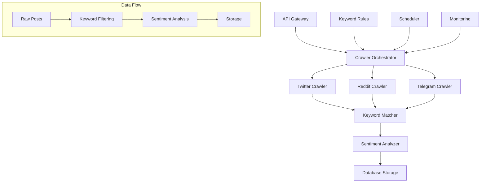

# Social Media Crawler Micro-Service

## Overview

A high-performance micro-service for crawling Twitter/X, Reddit, and Telegram with keyword-based rules. Available in two implementations:

1. **Laravel Octane** - High-performance PHP micro-service integrated with existing Laravel ecosystem
2. **Python Lambda** - Serverless AWS Lambda function for scalable, event-driven crawling

## 🏗️ Architecture



## 📊 Features

### Core Functionality
- ✅ **Multi-Platform Crawling**: Twitter/X, Reddit, Telegram
- ✅ **Keyword Rule Engine**: Advanced keyword matching with conditions
- ✅ **Real-time Processing**: Sentiment analysis and content filtering
- ✅ **Rate Limiting**: Respects platform API limits
- ✅ **Proxy Support**: SOCKS5 proxy for restricted networks
- ✅ **Async Processing**: High-performance concurrent crawling

### Data Processing
- ✅ **Sentiment Analysis**: Real-time sentiment scoring
- ✅ **Content Filtering**: Spam detection, duplicate removal
- ✅ **Keyword Matching**: Fuzzy matching, stemming support
- ✅ **Data Enrichment**: Metrics, engagement scoring

### Operational Features
- ✅ **Job Scheduling**: Cron-like scheduling for automated crawling
- ✅ **Health Monitoring**: Platform availability checks
- ✅ **Error Handling**: Comprehensive error tracking and recovery
- ✅ **API Management**: RESTful API for job control

## 🚀 Quick Start

### Laravel Octane Implementation

#### Prerequisites
```bash
# Laravel application with Octane
composer require laravel/octane

# Redis for caching and queues
docker run -d -p 6379:6379 redis:alpine

# Database migrations
php artisan migrate
```

#### Configuration
```php
// config/crawler_microservice.php
return [
    'platforms' => [
        'twitter' => [
            'enabled' => true,
            'rate_limit' => ['requests_per_hour' => 300]
        ],
        'reddit' => [
            'enabled' => true,
            'subreddits' => ['cryptocurrency', 'defi', 'ethereum']
        ],
        'telegram' => [
            'enabled' => true,
            'channels' => ['blockchain_security', 'defi_news']
        ]
    ]
];
```

#### Usage
```php
use App\Services\CrawlerMicroService\CrawlerOrchestrator;

$orchestrator = new CrawlerOrchestrator($keywordMatcher, $sentimentAnalyzer);

$results = $orchestrator->executeCrawlJob([
    'job_id' => 'crawl_001',
    'platforms' => ['twitter', 'reddit'],
    'keyword_rules' => ['bitcoin', 'ethereum', 'defi'],
    'max_posts' => 100
]);
```

### Python Lambda Implementation

#### Prerequisites
```bash
# Install Serverless Framework
npm install -g serverless

# Install Python dependencies
pip install -r lambda/crawler_microservice/requirements.txt

# Configure AWS credentials
aws configure
```

#### Environment Variables
```bash
# Social Media API Keys
export TWITTER_BEARER_TOKEN="your_twitter_bearer_token"
export REDDIT_CLIENT_ID="your_reddit_client_id"
export REDDIT_CLIENT_SECRET="your_reddit_client_secret"
export REDDIT_USERNAME="your_reddit_username"
export REDDIT_PASSWORD="your_reddit_password"
export TELEGRAM_BOT_TOKEN="your_telegram_bot_token"

# Proxy configuration
export PROXY_ENABLED=true
export PROXY_URL="socks5://192.168.1.32:8086"
```

#### Deployment
```bash
cd lambda/crawler_microservice
chmod +x deploy.sh
./deploy.sh dev us-east-1
```

## 📡 API Reference

### Start Crawling Job
```http
POST /api/crawler/start
Content-Type: application/json
Authorization: Bearer {token}

{
  "platforms": ["twitter", "reddit", "telegram"],
  "keyword_rules": ["bitcoin", "ethereum", "defi"],
  "max_posts": 100,
  "priority": "high",
  "async": true,
  "callback_url": "https://yourapp.com/webhook"
}
```

**Response:**
```json
{
  "success": true,
  "job_id": "crawl_abc123",
  "status": "queued",
  "estimated_completion": "2025-08-04T15:30:00Z"
}
```

### Get Job Status
```http
GET /api/crawler/job/{jobId}/status
Authorization: Bearer {token}
```

**Response:**
```json
{
  "success": true,
  "job_status": {
    "job_id": "crawl_abc123",
    "status": "completed",
    "progress": 100,
    "results": {
      "total_posts": 150,
      "total_matches": 89,
      "platforms": {
        "twitter": {"posts_found": 75, "keyword_matches": 45},
        "reddit": {"posts_found": 75, "keyword_matches": 44}
      }
    }
  }
}
```

### Keyword Rules Management

#### Create Keyword Rule
```http
POST /api/crawler/keyword-rules
Content-Type: application/json
Authorization: Bearer {token}

{
  "name": "Blockchain Security",
  "keywords": ["smart contract", "vulnerability", "exploit"],
  "platforms": ["twitter", "reddit"],
  "priority": "high",
  "schedule": {
    "interval_minutes": 30
  },
  "conditions": {
    "min_engagement": 10
  }
}
```

#### Update Keyword Rule
```http
PUT /api/crawler/keyword-rules/{id}
```

#### Get Keyword Rules
```http
GET /api/crawler/keyword-rules?platform=twitter&active=true
```

### Platform Statistics
```http
GET /api/crawler/stats
```

**Response:**
```json
{
  "success": true,
  "platform_stats": {
    "twitter": {
      "enabled": true,
      "total_posts": 1250,
      "posts_today": 89,
      "last_crawl": "2025-08-04T14:30:00Z"
    },
    "reddit": {
      "enabled": true,
      "total_posts": 890,
      "posts_today": 67,
      "last_crawl": "2025-08-04T14:25:00Z"
    }
  }
}
```

### Health Check
```http
GET /api/crawler/health
```

**Response:**
```json
{
  "status": "healthy",
  "timestamp": "2025-08-04T14:35:00Z",
  "services": {
    "twitter": {"status": "healthy", "response_time_ms": 120},
    "reddit": {"status": "healthy", "response_time_ms": 250},
    "telegram": {"status": "healthy", "response_time_ms": 180},
    "database": {"status": "healthy", "response_time_ms": 15},
    "queue": {"status": "healthy", "pending_jobs": 0}
  }
}
```

## 🔧 Configuration

### Keyword Rules Schema

```json
{
  "name": "Rule Name",
  "keywords": ["keyword1", "keyword2"],
  "platforms": ["twitter", "reddit", "telegram"],
  "conditions": {
    "min_engagement": 10,
    "exclude_retweets": true,
    "min_followers": 100,
    "language": "en"
  },
  "sentiment_filter": {
    "include": ["positive", "negative", "neutral"]
  },
  "schedule": {
    "interval_minutes": 30,
    "hours": [9, 12, 15, 18],
    "days_of_week": [1, 2, 3, 4, 5]
  },
  "priority": "high",
  "max_posts_per_run": 200,
  "is_active": true
}
```

### Rate Limiting Configuration

```php
// Laravel configuration
'platforms' => [
    'twitter' => [
        'rate_limit' => [
            'requests_per_hour' => 300,
            'delay_between_requests_ms' => 1000
        ]
    ],
    'reddit' => [
        'rate_limit' => [
            'requests_per_hour' => 100,
            'delay_between_requests_ms' => 2000
        ]
    ]
]
```

## 🔒 Security & Authentication

### API Authentication
The micro-service supports multiple authentication methods:

1. **Laravel Sanctum** (Laravel implementation)
2. **JWT Tokens** (Python Lambda)
3. **API Keys** (Both implementations)

### Example with API Key
```bash
curl -X POST "https://api.example.com/crawler/start" \
  -H "Authorization: Bearer your_api_token" \
  -H "Content-Type: application/json" \
  -d '{
    "platforms": ["twitter"],
    "keyword_rules": ["bitcoin"],
    "max_posts": 50
  }'
```

### Proxy Configuration
For networks with restricted API access:

```bash
# Environment variables
export PROXY_ENABLED=true
export PROXY_URL="socks5://192.168.1.32:8086"

# Laravel configuration
'proxy' => [
    'enabled' => env('PROXY_ENABLED', true),
    'url' => env('PROXY_URL', 'socks5://192.168.1.32:8086')
]
```

## 📈 Monitoring & Observability

### Metrics Tracking
- **Job Success Rate**: Percentage of successful crawling jobs
- **API Response Times**: Platform API performance monitoring
- **Rate Limit Usage**: Track API quota consumption
- **Data Quality**: Posts collected vs keyword matches ratio

### CloudWatch Dashboards (Lambda)
```json
{
  "widgets": [
    {
      "type": "metric",
      "properties": {
        "metrics": [
          ["AWS/Lambda", "Duration", "FunctionName", "social-crawler-microservice-dev-crawl"],
          ["AWS/Lambda", "Errors", "FunctionName", "social-crawler-microservice-dev-crawl"],
          ["AWS/Lambda", "Invocations", "FunctionName", "social-crawler-microservice-dev-crawl"]
        ],
        "period": 300,
        "stat": "Average",
        "region": "us-east-1",
        "title": "Crawler Performance"
      }
    }
  ]
}
```

### Alerting
Configure alerts for:
- **High Error Rate**: >10% errors in 5 minutes
- **Rate Limit Exceeded**: >80% of API quota used
- **Job Timeout**: Jobs running longer than expected
- **Platform Unavailability**: API endpoints unreachable

## 🚀 Performance Optimization

### Laravel Octane Optimization
```php
// config/octane.php
return [
    'server' => 'swoole',
    'max_execution_time' => 30,
    'max_requests' => 1000,
    'workers' => 4,
    'task_workers' => 2,
    'warm' => [
        'CrawlerOrchestrator',
        'TwitterCrawler',
        'RedditCrawler'
    ]
];
```

### Lambda Performance
- **Memory**: 1024 MB (optimal for concurrent crawling)
- **Timeout**: 15 minutes (maximum for comprehensive crawling)
- **Concurrent Executions**: Limited to 10 to respect API limits
- **Layer Usage**: Dependencies packaged in Lambda Layer

### Caching Strategy
- **API Responses**: Cache platform responses for 5 minutes
- **Keyword Rules**: Cache active rules for 10 minutes
- **Sentiment Results**: Cache sentiment analysis for 1 hour
- **Processed Content**: Cache to avoid duplicate processing

## 🔧 Troubleshooting

### Common Issues

#### 1. API Authentication Failures
```bash
# Check credentials
curl -X GET "https://api.twitter.com/2/tweets/search/recent?query=test" \
  -H "Authorization: Bearer $TWITTER_BEARER_TOKEN"

# Error: 401 Unauthorized
# Solution: Verify API keys in environment variables
```

#### 2. Rate Limit Exceeded
```json
{
  "error": "Rate limit exceeded",
  "platform": "twitter",
  "retry_after": 900
}
```
**Solution**: Increase delay between requests or implement exponential backoff

#### 3. Proxy Connection Issues
```bash
# Test proxy connectivity
curl --proxy socks5://192.168.1.32:8086 https://api.twitter.com/2/tweets/search/recent?query=test
```

#### 4. Memory Issues (Lambda)
```json
{
  "errorType": "Runtime.OutOfMemory",
  "errorMessage": "Process exited with status 9"
}
```
**Solution**: Increase Lambda memory allocation or reduce batch size

### Debug Mode
Enable debug logging:

```bash
# Laravel
LOG_LEVEL=debug

# Lambda
export PYTHON_LOG_LEVEL=DEBUG
```

### Health Checks
Regular health monitoring:

```bash
# Check all platforms
curl https://api.example.com/crawler/health

# Check specific job
curl https://api.example.com/crawler/job/crawl_123/status
```

## 📚 Advanced Usage

### Custom Keyword Matchers
```php
// Laravel - Custom keyword matching logic
class AdvancedKeywordMatcher extends KeywordMatcher
{
    public function findMatches(string $content, array $rules): array
    {
        // Implement fuzzy matching, regex patterns, sentiment-based filtering
        return parent::findMatches($content, $rules);
    }
}
```

### Webhook Integration
```python
# Python Lambda - Webhook notifications
async def send_webhook(callback_url: str, data: dict):
    async with aiohttp.ClientSession() as session:
        await session.post(callback_url, json=data)
```

### Batch Processing
```bash
# Process multiple keyword rules simultaneously
POST /api/crawler/start
{
  "keyword_rule_ids": [1, 2, 3],
  "batch_mode": true,
  "priority": "high"
}
```

## 🔄 Deployment Strategies

### Blue-Green Deployment (Lambda)
```bash
# Deploy to staging
./deploy.sh staging us-east-1

# Test staging environment
curl https://staging-api.example.com/crawler/health

# Promote to production
./deploy.sh prod us-east-1
```

### Rolling Updates (Laravel Octane)
```bash
# Zero-downtime deployment
php artisan octane:reload
php artisan queue:restart
```

### CI/CD Pipeline
```yaml
# GitHub Actions example
name: Deploy Crawler Micro-Service
on:
  push:
    branches: [main]
jobs:
  deploy:
    runs-on: ubuntu-latest
    steps:
      - uses: actions/checkout@v2
      - name: Deploy Lambda
        run: |
          cd lambda/crawler_microservice
          ./deploy.sh prod us-east-1
        env:
          TWITTER_BEARER_TOKEN: ${{ secrets.TWITTER_BEARER_TOKEN }}
          REDDIT_CLIENT_ID: ${{ secrets.REDDIT_CLIENT_ID }}
```

## 📖 Examples

### Complete Integration Example
```php
// Laravel Controller Integration
class SocialAnalysisController extends Controller
{
    public function startAnalysis(Request $request)
    {
        $keywordRule = CrawlerKeywordRule::create([
            'name' => 'Security Vulnerability Analysis',
            'keywords' => ['smart contract', 'vulnerability', 'exploit'],
            'platforms' => ['twitter', 'reddit'],
            'priority' => 'high'
        ]);

        $job = $this->crawler->executeCrawlJob([
            'job_id' => 'analysis_' . uniqid(),
            'keyword_rule_ids' => [$keywordRule->id],
            'max_posts' => 200,
            'async' => true
        ]);

        return response()->json([
            'job_id' => $job['job_id'],
            'keyword_rule_id' => $keywordRule->id,
            'status' => 'started'
        ]);
    }
}
```

### Lambda Event Example
```json
{
  "body": {
    "job_id": "scheduled_crawl_001",
    "platforms": ["twitter", "reddit"],
    "keyword_rules": [
      "bitcoin security",
      "ethereum vulnerability",
      "defi exploit"
    ],
    "max_posts": 150,
    "priority": "normal",
    "callback_url": "https://yourapp.com/webhook/crawler"
  }
}
```

## 🏆 Best Practices

### Performance
1. **Use Connection Pooling**: Reuse HTTP connections for API calls
2. **Implement Caching**: Cache frequently accessed data
3. **Batch Operations**: Process multiple items together
4. **Async Processing**: Use async/await for concurrent operations

### Security
1. **Rotate API Keys**: Regular credential rotation
2. **Use Secrets Manager**: Store sensitive data securely
3. **Implement Rate Limiting**: Protect against abuse
4. **Monitor Access**: Log all API interactions

### Reliability
1. **Implement Retries**: Handle transient failures
2. **Circuit Breakers**: Prevent cascade failures
3. **Health Checks**: Monitor service availability
4. **Graceful Degradation**: Continue operating with reduced functionality

### Monitoring
1. **Structured Logging**: Use consistent log formats
2. **Metrics Collection**: Track key performance indicators
3. **Alerting**: Set up proactive notifications
4. **Dashboard Visualization**: Create operational dashboards

---

## 🤝 Contributing

### Development Setup
```bash
# Clone repository
git clone https://github.com/your-org/ai-blockchain-analytics

# Setup Laravel environment
composer install
cp .env.example .env
php artisan key:generate

# Setup Lambda environment
cd lambda/crawler_microservice
python -m venv venv
source venv/bin/activate
pip install -r requirements.txt
```

### Testing
```bash
# Laravel tests
php artisan test --filter CrawlerMicroService

# Lambda tests
cd lambda/crawler_microservice
python -m pytest tests/
```

### Code Style
- **Laravel**: Follow PSR-12 standards
- **Python**: Use Black formatter and flake8 linting
- **Documentation**: Update README for any API changes

---

**Support**: For issues and questions, please create a GitHub issue or contact the development team.

**License**: MIT License - see LICENSE file for details.