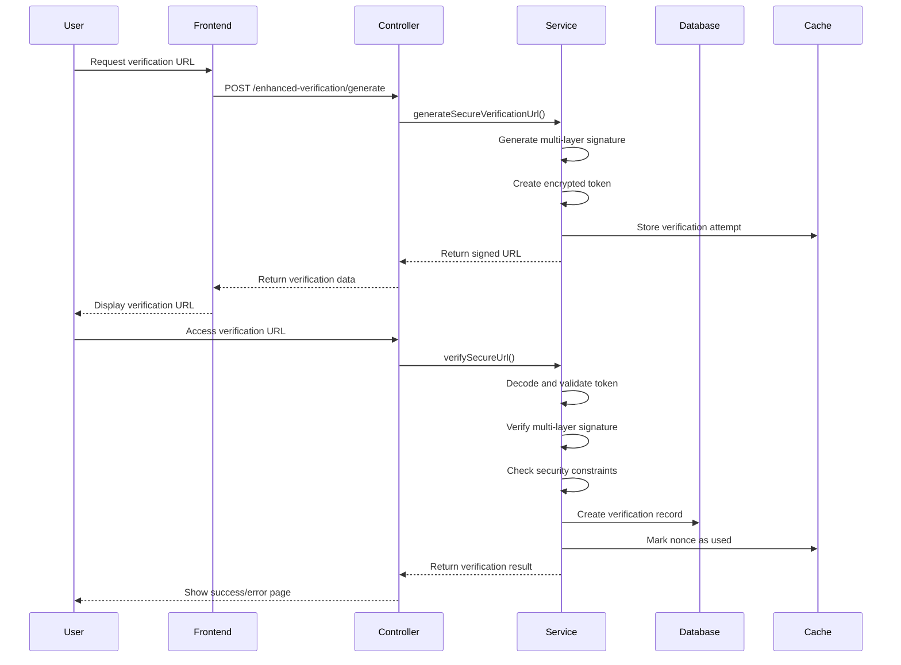

# 🛡️ Enhanced Verification Badge System

**Secure Smart Contract Verification with SHA-256 + HMAC Protection**

## 📋 Table of Contents

- [Overview](#overview)
- [Security Features](#security-features)
- [Architecture](#architecture)
- [Quick Start](#quick-start)
- [API Reference](#api-reference)
- [Vue Components](#vue-components)
- [Configuration](#configuration)
- [Security Details](#security-details)
- [Integration Guide](#integration-guide)
- [Troubleshooting](#troubleshooting)

## 🎯 Overview

The Enhanced Verification Badge System provides cryptographically secure verification for smart contracts using advanced security measures including SHA-256 + HMAC signatures, multi-layer protection, and comprehensive anti-spoofing mechanisms.

### Key Benefits

- **🔒 Cryptographic Security**: SHA-256 + HMAC multi-layer signatures
- **🛡️ Anti-spoofing Protection**: IP and user agent binding
- **⚡ Replay Attack Prevention**: One-time nonce usage
- **🎯 Tamper Detection**: Payload integrity verification
- **📊 Real-time Validation**: Instant verification status checking
- **🔌 Easy Integration**: Simple API and Vue components

## 🛡️ Security Features

### Multi-layer Signature Protection
- **Layer 1**: Basic HMAC with secret key
- **Layer 2**: Timestamp and nonce binding
- **Layer 3**: Contract address binding
- **Signature Version**: `v3.0` for future compatibility

### Anti-spoofing Measures
- **IP Address Binding**: Prevents use from different locations
- **User Agent Binding**: Prevents use from different browsers/devices
- **Payload Checksum**: Ensures data integrity
- **Time-bound URLs**: Configurable expiration (30 minutes to 4 hours)

### Replay Attack Prevention
- **Cryptographic Nonces**: 64-character unique identifiers
- **One-time Usage**: Nonces are marked as used after verification
- **Attempt Tracking**: Comprehensive logging of all verification attempts

## 🏗️ Architecture

### Core Components

```
┌─────────────────────────────────────────────────────────────┐
│                    Enhanced Verification System             │
├─────────────────────────────────────────────────────────────┤
│  🎯 EnhancedVerificationBadgeService                       │
│  ├── Generate secure URLs with multi-layer signatures      │
│  ├── Verify signed URLs with comprehensive checks          │
│  └── Manage badge data and security features               │
├─────────────────────────────────────────────────────────────┤
│  🎮 EnhancedVerificationController                         │
│  ├── API endpoints for URL generation and verification     │
│  ├── Badge status checking and management                  │
│  └── Batch operations and statistics                       │
├─────────────────────────────────────────────────────────────┤
│  🎨 Vue Components                                          │
│  ├── EnhancedVerificationBadge (display component)         │
│  ├── VerificationManager (generation interface)            │
│  └── Demo pages and management interfaces                  │
└─────────────────────────────────────────────────────────────┘
```

### Security Flow



## 🚀 Quick Start

### 1. Configuration

Add to your `.env` file:

```env
# Enhanced Verification Configuration
VERIFICATION_SECRET_KEY=your-secret-key-here
VERIFICATION_HMAC_KEY=your-hmac-key-here
VERIFICATION_URL_LIFETIME=3600
VERIFICATION_REQUIRE_IP_BINDING=true
VERIFICATION_REQUIRE_USER_AGENT_BINDING=true
VERIFICATION_ENABLE_RATE_LIMITING=true
VERIFICATION_MAX_ATTEMPTS=5
```

### 2. Generate Verification URL

```php
use App\Services\EnhancedVerificationBadgeService;

$service = app(EnhancedVerificationBadgeService::class);

$result = $service->generateSecureVerificationUrl(
    contractAddress: '0x1234567890123456789012345678901234567890',
    userId: auth()->id(),
    metadata: [
        'project_name' => 'My DeFi Protocol',
        'website' => 'https://example.com',
        'description' => 'A secure DeFi protocol',
        'category' => 'DeFi'
    ],
    options: [
        'lifetime' => 3600 // 1 hour
    ]
);

echo $result['verification_url'];
```

### 3. Display Badge

```vue
<template>
    <EnhancedVerificationBadge
        contract-address="0x1234567890123456789012345678901234567890"
        :show-unverified="true"
        tooltip-position="top"
    />
</template>

<script setup>
import EnhancedVerificationBadge from '@/Components/Verification/EnhancedVerificationBadge.vue'
</script>
```

### 4. Check Verification Status

```javascript
// API call
const response = await fetch('/enhanced-verification/status/0x1234567890123456789012345678901234567890')
const data = await response.json()

if (data.success && data.data.is_verified) {
    console.log('Contract is verified!')
    console.log('Security level:', data.data.security_level)
}
```

## 📡 API Reference

### Generate Verification URL

**Endpoint:** `POST /enhanced-verification/generate`

**Authentication:** Required

**Request Body:**
```json
{
    "contract_address": "0x1234567890123456789012345678901234567890",
    "metadata": {
        "project_name": "My DeFi Protocol",
        "website": "https://example.com",
        "description": "A secure DeFi protocol",
        "category": "DeFi",
        "tags": ["defi", "lending", "yield"]
    },
    "options": {
        "lifetime": 3600
    }
}
```

**Response:**
```json
{
    "success": true,
    "message": "Secure verification URL generated successfully",
    "data": {
        "verification_url": "https://example.com/enhanced-verification/verify/eyJ0eXAi...",
        "token": "eyJ0eXAiOiJKV1QiLCJhbGciOiJIUzI1NiJ9...",
        "nonce": "abc123def456...",
        "expires_at": "2025-08-07T10:30:00.000000Z",
        "expires_in": 3600,
        "security_level": "enhanced",
        "signature_version": "v3.0"
    }
}
```

### Verify Signed URL

**Endpoint:** `GET /enhanced-verification/verify/{token}`

**Authentication:** None (public endpoint)

**Response:** Redirects to success or error page

### Get Verification Status

**Endpoint:** `GET /enhanced-verification/status/{contractAddress}`

**Authentication:** None (public endpoint)

**Response:**
```json
{
    "success": true,
    "data": {
        "contract_address": "0x1234567890123456789012345678901234567890",
        "is_verified": true,
        "verification_method": "enhanced_signed_url",
        "verified_at": "2025-08-07T09:30:00.000000Z",
        "project_name": "My DeFi Protocol",
        "security_level": "enhanced",
        "security_features": {
            "signature_algorithm": "SHA-256 + HMAC",
            "multi_layer_protection": true,
            "anti_spoofing": true,
            "replay_protection": true,
            "ip_binding": true,
            "user_agent_binding": true
        },
        "badge_version": "v3.0"
    }
}
```

### Get Badge HTML

**Endpoint:** `GET /enhanced-verification/badge/{contractAddress}`

**Authentication:** None (public endpoint)

**Response:** HTML content for embedding

### User Verifications

**Endpoint:** `GET /enhanced-verification/my-verifications`

**Authentication:** Required

**Response:**
```json
{
    "success": true,
    "data": {
        "verifications": [
            {
                "contract_address": "0x1234567890123456789012345678901234567890",
                "is_verified": true,
                "verified_at": "2025-08-07T09:30:00.000000Z",
                "project_name": "My DeFi Protocol",
                "verification_age": "2 hours ago"
            }
        ],
        "total_count": 1,
        "active_count": 1
    }
}
```

### Revoke Verification

**Endpoint:** `POST /enhanced-verification/revoke`

**Authentication:** Required

**Request Body:**
```json
{
    "contract_address": "0x1234567890123456789012345678901234567890",
    "reason": "Contract updated"
}
```

### Batch Generate URLs

**Endpoint:** `POST /enhanced-verification/batch/generate`

**Authentication:** Required

**Request Body:**
```json
{
    "contracts": [
        {
            "contract_address": "0x1234567890123456789012345678901234567890",
            "metadata": {
                "project_name": "Protocol A"
            }
        },
        {
            "contract_address": "0x0987654321098765432109876543210987654321",
            "metadata": {
                "project_name": "Protocol B"
            }
        }
    ],
    "options": {
        "lifetime": 3600
    }
}
```

### Get Statistics

**Endpoint:** `GET /enhanced-verification/stats`

**Authentication:** Required

**Response:**
```json
{
    "success": true,
    "data": {
        "total_verifications": 15,
        "active_verifications": 12,
        "revoked_verifications": 2,
        "expired_verifications": 1,
        "recent_verifications": 5,
        "verification_methods": {
            "enhanced_signed_url": 12,
            "signed_url": 3
        }
    }
}
```

## 🎨 Vue Components

### EnhancedVerificationBadge

**Purpose:** Display verification badges with security indicators

**Props:**
- `contractAddress` (String, required): Contract address to check
- `showUnverified` (Boolean, default: false): Show badge for unverified contracts
- `tooltipPosition` (String, default: 'top'): Tooltip position (top, bottom, left, right)
- `autoLoad` (Boolean, default: true): Automatically load verification status

**Events:**
- `verification-loaded`: Emitted when verification data is loaded
- `error`: Emitted when an error occurs

**Usage:**
```vue
<EnhancedVerificationBadge
    contract-address="0x1234567890123456789012345678901234567890"
    :show-unverified="true"
    tooltip-position="bottom"
    @verification-loaded="handleVerificationLoaded"
    @error="handleError"
/>
```

### VerificationManager

**Purpose:** Generate verification URLs with form interface

**Features:**
- Contract address validation
- Metadata input (project name, website, description, category)
- URL lifetime configuration
- Real-time error handling
- Copy-to-clipboard functionality

**Usage:**
```vue
<VerificationManager />
```

## ⚙️ Configuration

### Environment Variables

```env
# Cryptographic Keys
VERIFICATION_SECRET_KEY=your-secret-key-here
VERIFICATION_HMAC_KEY=your-hmac-key-here

# URL Configuration
VERIFICATION_URL_LIFETIME=3600

# Security Features
VERIFICATION_REQUIRE_IP_BINDING=true
VERIFICATION_REQUIRE_USER_AGENT_BINDING=true
VERIFICATION_ENABLE_RATE_LIMITING=true
VERIFICATION_ENABLE_NONCE_TRACKING=true

# Rate Limiting
VERIFICATION_MAX_ATTEMPTS=5
VERIFICATION_RATE_LIMIT_WINDOW=3600
VERIFICATION_GLOBAL_MAX_PER_IP=20

# Caching
VERIFICATION_CACHE_DURATION=3600
VERIFICATION_ENABLE_REDIS=true

# Display
VERIFICATION_SHOW_SECURITY_LEVEL=true
VERIFICATION_ENABLE_TOOLTIPS=true
VERIFICATION_BADGE_THEME=default

# Logging
VERIFICATION_LOG_ATTEMPTS=true
VERIFICATION_LOG_SECURITY_VIOLATIONS=true
VERIFICATION_LOG_SUCCESSFUL=true
VERIFICATION_LOG_LEVEL=info

# Database
VERIFICATION_CLEANUP_EXPIRED=true
VERIFICATION_CLEANUP_INTERVAL=24
VERIFICATION_RETENTION_DAYS=365

# API
VERIFICATION_ENABLE_CORS=true
VERIFICATION_CORS_ORIGINS=*
VERIFICATION_MAX_BATCH_SIZE=10

# Development
VERIFICATION_TEST_MODE=false
VERIFICATION_DEBUG_LOGGING=false
```

### Configuration File

The system uses `config/verification.php` for detailed configuration:

```php
return [
    'secret_key' => env('VERIFICATION_SECRET_KEY', null),
    'hmac_key' => env('VERIFICATION_HMAC_KEY', null),
    'url_lifetime' => env('VERIFICATION_URL_LIFETIME', 3600),
    
    'security' => [
        'require_ip_binding' => env('VERIFICATION_REQUIRE_IP_BINDING', true),
        'require_user_agent_binding' => env('VERIFICATION_REQUIRE_USER_AGENT_BINDING', true),
        'enable_rate_limiting' => env('VERIFICATION_ENABLE_RATE_LIMITING', true),
        'enable_nonce_tracking' => env('VERIFICATION_ENABLE_NONCE_TRACKING', true),
        'signature_version' => 'v3.0',
    ],
    
    // ... additional configuration options
];
```

## 🔒 Security Details

### Signature Generation Process

1. **Payload Creation**: Combine contract address, user ID, timestamp, nonce, and metadata
2. **Checksum Calculation**: Generate SHA-256 hash of payload for integrity verification
3. **Layer 1 Signature**: HMAC-SHA256 with secret key and canonical string
4. **Layer 2 Signature**: HMAC-SHA256 with HMAC key, timestamp, and nonce binding
5. **Layer 3 Signature**: HMAC-SHA256 with secret key and contract address binding
6. **Final Token**: Base64-encoded JSON with payload, signature, and additional HMAC

### Verification Process

1. **Token Decoding**: Decode and parse the verification token
2. **Structure Validation**: Verify token contains required components
3. **Signature Verification**: Recreate and compare all signature layers
4. **HMAC Verification**: Validate additional HMAC for token integrity
5. **Security Checks**: Verify expiration, nonce uniqueness, IP/UA binding
6. **Payload Integrity**: Verify checksum matches payload content
7. **Database Update**: Create verification record and mark nonce as used

### Security Constraints

- **Time Bounds**: URLs expire between 30 minutes and 4 hours
- **One-time Use**: Nonces prevent replay attacks
- **Device Binding**: IP and user agent must match generation context
- **Rate Limiting**: Maximum 5 attempts per user per contract per hour
- **Global Limits**: Maximum 20 attempts per IP per hour
- **Signature Versioning**: Supports multiple signature versions for compatibility

## 🔌 Integration Guide

### Basic Integration

1. **Generate URL**: Create verification URL through API or service
2. **Send to User**: Email or display the verification URL
3. **User Verification**: User clicks URL to complete verification
4. **Display Badge**: Show verification badge on contract listings

### Advanced Integration

#### Webhook Integration

```php
// config/verification.php
'integration' => [
    'webhook_url' => 'https://your-app.com/webhooks/verification',
    'webhook_secret' => 'your-webhook-secret',
],
```

#### Blockchain Verification

```php
// config/verification.php
'integration' => [
    'verify_on_blockchain' => true,
    'rpc_endpoints' => [
        'ethereum' => 'https://mainnet.infura.io/v3/your-key',
        'bsc' => 'https://bsc-dataseed.binance.org/',
        'polygon' => 'https://polygon-rpc.com/',
    ],
],
```

### Frontend Integration

#### React Integration

```jsx
import { useState, useEffect } from 'react'

function VerificationBadge({ contractAddress }) {
    const [verification, setVerification] = useState(null)
    
    useEffect(() => {
        fetch(`/enhanced-verification/status/${contractAddress}`)
            .then(res => res.json())
            .then(data => {
                if (data.success) {
                    setVerification(data.data)
                }
            })
    }, [contractAddress])
    
    if (!verification?.is_verified) return null
    
    return (
        <div className="verification-badge">
            <span>✅ Enhanced Verified</span>
            <span>{verification.security_level}</span>
        </div>
    )
}
```

#### HTML/JavaScript Integration

```html
<div id="verification-badge" data-contract="0x1234..."></div>

<script>
async function loadVerificationBadge(contractAddress) {
    try {
        const response = await fetch(`/enhanced-verification/badge/${contractAddress}`)
        const html = await response.text()
        document.getElementById('verification-badge').innerHTML = html
    } catch (error) {
        console.error('Failed to load verification badge:', error)
    }
}

// Load badge for contract
loadVerificationBadge('0x1234567890123456789012345678901234567890')
</script>
```

## 🔧 Troubleshooting

### Common Issues

#### 1. Verification URL Expired
**Error:** "Verification URL has expired"
**Solution:** Generate a new verification URL with a longer lifetime

#### 2. Signature Verification Failed
**Error:** "Enhanced signature verification failed"
**Solution:** Ensure the URL hasn't been modified and is accessed from the same device/IP

#### 3. Contract Already Verified
**Error:** "Contract is already verified"
**Solution:** Check verification management page or revoke existing verification

#### 4. Rate Limit Exceeded
**Error:** "Too many verification attempts"
**Solution:** Wait for the rate limit window to reset (default: 1 hour)

#### 5. Invalid Contract Address
**Error:** "Invalid contract address format"
**Solution:** Ensure address is a valid 40-character hexadecimal string with 0x prefix

### Debug Mode

Enable debug logging in development:

```env
VERIFICATION_DEBUG_LOGGING=true
VERIFICATION_TEST_MODE=true
VERIFICATION_INCLUDE_DEBUG=true
```

### Monitoring

Check logs for security violations:

```bash
# Laravel logs
tail -f storage/logs/laravel.log | grep "verification"

# Specific verification events
tail -f storage/logs/laravel.log | grep "Enhanced verification"
```

## 📊 Performance Considerations

### Caching Strategy

- **Redis Caching**: Verification status cached for 1 hour by default
- **Database Indexing**: Indexes on contract_address, user_id, verified_at
- **Query Optimization**: Efficient queries for verification lookups

### Scalability

- **Queue Processing**: Optional background processing for verification
- **Batch Operations**: Support for bulk verification URL generation
- **Rate Limiting**: Prevents abuse and ensures fair usage

### Security vs Performance

- **Security First**: All security checks are mandatory
- **Caching**: Verification results cached to reduce database load
- **Async Processing**: Non-critical operations can be queued

## 🎯 Best Practices

### Security Best Practices

1. **Rotate Keys Regularly**: Change secret and HMAC keys periodically
2. **Monitor Violations**: Watch for signature failures and security violations
3. **Use HTTPS**: Always use HTTPS for verification URLs
4. **Validate Input**: Sanitize all user input and metadata
5. **Audit Logs**: Regularly review verification logs for anomalies

### Performance Best Practices

1. **Enable Caching**: Use Redis for optimal performance
2. **Database Maintenance**: Regularly clean up expired records
3. **Monitor Resources**: Watch database and cache usage
4. **Optimize Queries**: Use proper indexing and query optimization
5. **Load Testing**: Test system under expected load

### Integration Best Practices

1. **Error Handling**: Implement proper error handling and user feedback
2. **Fallback Options**: Provide alternatives when verification fails
3. **User Experience**: Make verification process clear and simple
4. **Documentation**: Document your integration for team members
5. **Testing**: Thoroughly test verification flow in all environments

---

## 🚀 Ready to Use!

The Enhanced Verification Badge System is now fully configured and ready for production use. The system provides enterprise-grade security with user-friendly interfaces and comprehensive API coverage.

### Quick Access Links

- **Demo Page**: `/enhanced-verification/demo`
- **Management**: `/enhanced-verification/manage`
- **API Docs**: This document
- **Configuration**: `config/verification.php`

### Support

For additional support or questions:
- Check the troubleshooting section above
- Review Laravel logs for detailed error information
- Consult the API reference for integration details

**Your smart contracts are now protected with military-grade cryptographic verification!** 🛡️✨