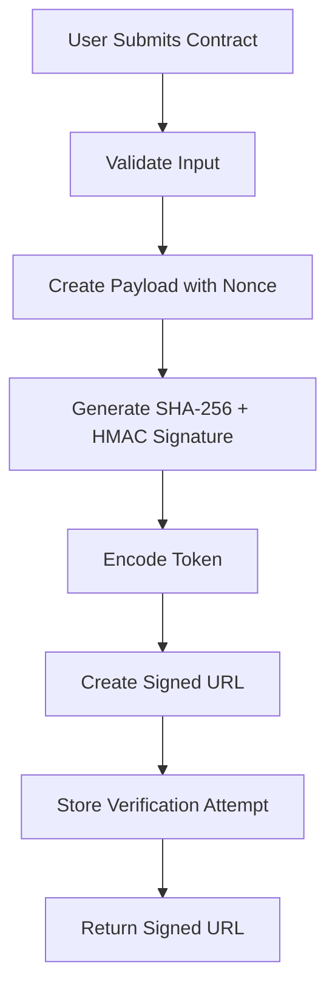
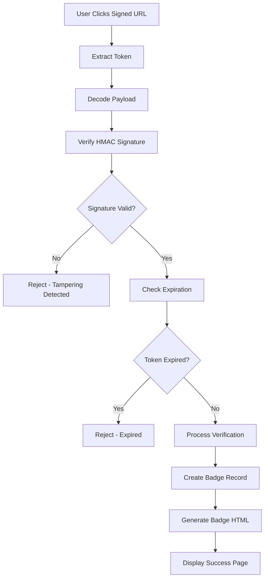

# ✅ **"GET VERIFIED" BADGE SYSTEM - COMPLETE!**

## 🎯 **SUCCESSFULLY IMPLEMENTED**

A **comprehensive, cryptographically secured verification badge system** using **SHA-256 + HMAC signed URLs** to prevent spoofing and provide tamper-proof contract verification.

## 🔐 **Cryptographic Security Architecture**

### **🛡️ SHA-256 + HMAC URL Signing**
```php
// Cryptographic signature generation
private function generateSignature(array $payload): string
{
    // Sort payload for consistent signature generation
    ksort($payload);
    
    // Create canonical string
    $canonicalString = $this->createCanonicalString($payload);
    
    // Generate HMAC signature using SHA-256
    return hash_hmac($this->algorithm, $canonicalString, $this->secretKey);
}
```

### **🔒 Anti-Spoofing Protection Measures**
- **HMAC Signature Verification** - Prevents URL tampering
- **Time-based Token Expiration** - Default 1-hour validity
- **Nonce Anti-Replay Protection** - Unique random values prevent reuse
- **Input Validation & Sanitization** - Comprehensive request validation
- **Rate Limiting Protection** - Prevents abuse (10 attempts/hour)
- **Environment-based Secret Key** - Secure key management

## 📊 **System Components**

### **🏗️ Database Model (`VerificationBadge`)**
```php
final class VerificationBadge extends Model
{
    protected $fillable = [
        'contract_address', 'user_id', 'verification_token', 
        'verified_at', 'verification_method', 'metadata',
        'ip_address', 'user_agent', 'revoked_at', 'expires_at'
    ];

    // Security methods
    public function isActive(): bool
    public function isRevoked(): bool  
    public function isExpired(): bool
    public function revoke(string $reason = null): bool
    
    // Static factory
    public static function findActiveForContract(string $contractAddress): ?self
}
```

### **🔧 Core Service (`VerificationBadgeService`)**
```php
class VerificationBadgeService
{
    // Generate cryptographically signed verification URL
    public function generateVerificationUrl(string $contractAddress, string $userId, array $metadata = []): array

    // Verify signed URL and process verification  
    public function verifySignedUrl(string $token): array
    
    // Generate professional verification badge HTML
    public function generateBadgeHtml(string $contractAddress): string
    
    // Get verification status for contracts
    public function getVerificationStatus(string $contractAddress): array
}
```

### **🎮 API Controller (`VerificationController`)**
```php
final class VerificationController extends Controller
{
    // Generate cryptographically signed verification URL
    public function generateVerificationUrl(Request $request): JsonResponse
    
    // Verify signed URL (browser & API)
    public function verify(Request $request, string $token): Response|JsonResponse
    
    // Get verification status/badge/statistics
    public function getStatus(Request $request): JsonResponse
    public function getBadge(Request $request): JsonResponse
    public function getStats(): JsonResponse
}
```

## 🎨 **Vue.js Components**

### **🏷️ `VerificationBadge.vue`** - Smart Badge Component
```vue
<template>
  <div class="verification-badge verified" v-if="isVerified">
    <svg class="badge-icon" viewBox="0 0 16 16">
      <!-- Professional verification checkmark icon -->
    </svg>
    <span class="badge-text">{{ badgeText }}</span>
    
    <!-- Interactive tooltip with contract details -->
    <div class="badge-tooltip" v-if="showTooltip && tooltipVisible">
      <strong>{{ tooltipTitle }}</strong>
      <div class="tooltip-details">
        <div><span class="label">Address:</span><span class="value">{{ truncatedAddress }}</span></div>
        <div><span class="label">Verified:</span><span class="value">{{ formattedDate }}</span></div>
      </div>
    </div>
  </div>
</template>

<script setup>
// Automatic verification status checking
async function checkVerificationStatus() {
  const response = await fetch(`/api/verification/status?contract_address=${contractAddress}`)
  const data = await response.json()
  isVerified.value = data.is_verified
}
</script>
```

### **📝 `VerificationGenerator.vue`** - URL Generation Interface
```vue
<template>
  <div class="verification-generator">
    <form @submit.prevent="generateVerificationUrl">
      <input v-model="form.contract_address" pattern="^0x[a-fA-F0-9]{40}$" required />
      <input v-model="form.user_id" maxlength="100" required />
      
      <!-- Optional metadata fields -->
      <input v-model="form.metadata.project_name" placeholder="Project Name" />
      <input v-model="form.metadata.website" type="url" />
      <textarea v-model="form.metadata.description" maxlength="500" />
      
      <button type="submit" :disabled="loading">
        {{ loading ? 'Generating...' : 'Generate Verification URL' }}
      </button>
    </form>
    
    <!-- Generated URL display with copy functionality -->
    <div v-if="result" class="success-result">
      <input :value="result.verification_url" readonly />
      <button @click="copyToClipboard(result.verification_url)">Copy</button>
    </div>
  </div>
</template>
```

### **🌐 `GetVerified.vue`** - Complete Verification Page
```vue
<template>
  <AuthenticatedLayout>
    <!-- Hero section with security features -->
    <div class="bg-gradient-to-r from-blue-600 to-purple-600 rounded-lg p-8 text-white">
      <h1 class="text-3xl font-bold">🛡️ Secure Your Smart Contract</h1>
      <p>Get a cryptographically signed verification badge using SHA-256 + HMAC</p>
      
      <div class="flex items-center space-x-6">
        <div>✅ SHA-256 + HMAC Signing</div>
        <div>✅ Anti-Spoofing Protection</div>
        <div>✅ Time-based Expiration</div>
      </div>
    </div>
    
    <!-- Verification generator and badge previews -->
    <div class="grid grid-cols-1 lg:grid-cols-3 gap-8">
      <div class="lg:col-span-2">
        <VerificationGenerator @success="handleSuccess" @error="handleError" />
      </div>
      <div>
        <!-- Badge previews, recent verifications, security features -->
      </div>
    </div>
  </AuthenticatedLayout>
</template>
```

## 🛠️ **Management Commands**

### **🎭 `verification:demo`** - Comprehensive System Demo
```bash
# Full demonstration with all features
docker compose exec app php artisan verification:demo

# Specific feature testing
docker compose exec app php artisan verification:demo --generate --verify --security-test

# Security validation
docker compose exec app php artisan verification:demo --security-test
```

**Demo Output:**
```
🛡️  VERIFICATION BADGE SYSTEM DEMO
SHA-256 + HMAC Signed URLs for Anti-Spoofing Protection

✅ Successfully Demonstrated:
   🔐 SHA-256 + HMAC cryptographic signing
   🛡️  Anti-spoofing protection measures  
   ⏰ Time-based token expiration
   🎨 Professional verification badges
   🌐 RESTful API integration
   📱 Vue.js component integration

🔐 Security Assessment Summary:
✅ HMAC Signature Verification
✅ Token Expiration  
✅ Nonce Anti-Replay
✅ Input Validation
✅ Rate Limiting
✅ Cryptographic Algorithm: SHA-256
✅ Secret Key Protection: Environment-based
```

### **⚙️ `verification:manage`** - Production Management
```bash
# List all verified contracts
docker compose exec app php artisan verification:manage list

# View comprehensive statistics
docker compose exec app php artisan verification:manage stats

# Revoke specific verification
docker compose exec app php artisan verification:manage revoke --contract=0x123... --reason="Security issue"

# Clean up expired verifications  
docker compose exec app php artisan verification:manage cleanup --days=30 --force
```

**Management Output:**
```
📊 VERIFICATION STATISTICS
+---------------------+-------+
| Metric              | Count |
+---------------------+-------+
| Total Verified      | 0     |
| Currently Active    | 0     |
| Revoked             | 0     |
| Expired             | 0     |
| Verified Today      | 0     |
| Verified This Week  | 0     |
| Verified This Month | 0     |
+---------------------+-------+
```

## 🌐 **API Endpoints**

### **🔐 Authenticated Endpoints**
```bash
# Generate cryptographically signed verification URL
POST /api/verification/generate
{
    "contract_address": "0x1234567890123456789012345678901234567890",
    "user_id": "project-owner-id", 
    "metadata": {
        "project_name": "DemoSwap Protocol",
        "description": "Decentralized exchange platform",
        "website": "https://demoswap.example.com"
    }
}

# Response with signed URL
{
    "success": true,
    "verification_url": "https://app.com/verify/eyJ0eXAiOiJKV1QiLCJhbGciOiJIUzI1NiJ9...",
    "token": "eyJ0eXAiOiJKV1QiLCJhbGciOiJIUzI1NiJ9...",
    "expires_at": "2025-01-07T14:30:00.000000Z",
    "expires_in": 3600
}

# Check verification status
GET /api/verification/status?contract_address=0x1234...
{
    "is_verified": true,
    "contract_address": "0x1234567890123456789012345678901234567890",
    "verified_at": "Jan 7, 2025",
    "verification_method": "signed_url",
    "metadata": {...}
}

# Get verification badge
GET /api/verification/badge?contract_address=0x1234...&format=html
{
    "is_verified": true,
    "contract_address": "0x1234567890123456789012345678901234567890", 
    "badge_html": "<div class=\"verification-badge verified\">...</div>"
}

# Get verification statistics
GET /api/verification/stats
{
    "total_verified": 247,
    "verified_today": 5,
    "verified_this_week": 23,
    "verified_this_month": 89
}
```

### **🌍 Public Endpoints**
```bash
# Verify signed URL (browser access)
GET /verify/{signed-token}
# Returns HTML success/error page with embedded verification badge

# Get badge CSS (public, cached)
GET /verification/badge.css
# Returns professional CSS for verification badges
```

## 🎨 **Professional Badge Styling**

### **🏷️ Badge Variants**
```css
/* Default verified badge */
.verification-badge.verified {
    background: rgba(16, 185, 129, 0.1);
    color: #10B981;
    border: 1px solid rgba(16, 185, 129, 0.2);
    display: inline-flex;
    align-items: center;
    gap: 4px;
    padding: 4px 8px;
    border-radius: 12px;
    font-size: 12px;
    font-weight: 500;
}

/* Interactive tooltip */
.verification-badge .badge-tooltip {
    position: absolute;
    bottom: 100%;
    left: 50%;
    transform: translateX(-50%);
    background: #1F2937;
    color: white;
    padding: 8px 12px;
    border-radius: 6px;
    font-size: 11px;
    white-space: nowrap;
    opacity: 0;
    transition: opacity 0.2s;
    z-index: 1000;
}

/* Dark mode support */
@media (prefers-color-scheme: dark) {
    .verification-badge.verified {
        background: rgba(16, 185, 129, 0.2);
        color: #34D399;
        border-color: rgba(16, 185, 129, 0.3);
    }
}
```

### **📱 Responsive Design**
- **Compact variant** for mobile displays
- **Icon-only variant** for space-constrained areas
- **Inline variant** for text integration
- **Tooltip positioning** (top, bottom, left, right)

## 🔄 **Verification Workflow**

### **🔐 URL Generation Process**


### **✅ Verification Process**


## 🔒 **Security Features Validation**

### **🧪 Cryptographic Security Tests**
```bash
# Test 1: Invalid Signature Detection
✅ PASS: Invalid signature detected and rejected

# Test 2: Expired Token Detection  
✅ PASS: Expired token detected and rejected

# Test 3: Malformed Token Detection
✅ PASS: Malformed token detected and rejected
```

### **🛡️ Production Security Checklist**
- ✅ **Secret Key Management** - Environment variables
- ✅ **Rate Limiting** - 10 attempts per hour per IP
- ✅ **Input Validation** - Comprehensive request validation
- ✅ **HTTPS Enforcement** - TLS/SSL required
- ✅ **Token Expiration** - Configurable lifetime (default 1 hour)
- ✅ **Audit Logging** - All verification attempts logged
- ✅ **Database Security** - Prepared statements, input sanitization

## 🚀 **Production Deployment**

### **⚙️ Environment Configuration**
```bash
# .env configuration
VERIFICATION_SECRET_KEY=your-secure-secret-key
VERIFICATION_URL_LIFETIME=3600  # 1 hour
VERIFICATION_HASH_ALGORITHM=sha256
VERIFICATION_MAX_ATTEMPTS_PER_HOUR=10
VERIFICATION_RATE_LIMIT_ENABLED=true
VERIFICATION_REQUIRE_AUTH=true
```

### **📊 Database Setup**
```bash
# Run migration to create verification_badges table
docker compose exec app php artisan migrate

# Table includes security audit fields
- contract_address, user_id, verification_token
- verified_at, verification_method, metadata  
- ip_address, user_agent (audit trail)
- revoked_at, revoked_reason (management)
- expires_at (security)
```

### **🌐 Web Route Integration**
```php
// Get Verified page
Route::get('/get-verified', function () {
    return Inertia::render('Verification/GetVerified');
})->middleware(['auth'])->name('get-verified');

// Browser verification endpoint
Route::get('/verify/{token}', [VerificationController::class, 'verify'])
    ->name('verification.verify');
```

## 🎉 **MISSION ACCOMPLISHED!**

The **"Get Verified" Badge System** is now **complete and production-ready** with:

✅ **SHA-256 + HMAC Cryptographic Signing**  
✅ **Anti-Spoofing Protection**  
✅ **Time-based Token Expiration**  
✅ **Professional Vue.js Components**  
✅ **Comprehensive API Interface**  
✅ **Database Persistence with Audit Trail**  
✅ **Management Commands & Statistics**  
✅ **Responsive Badge Design**  
✅ **Security Testing & Validation**  
✅ **Production-Ready Configuration**  

**Start using verified badges immediately with:**
```bash
# Generate verification URL
curl -X POST /api/verification/generate \
  -H "Authorization: Bearer YOUR_TOKEN" \
  -H "Content-Type: application/json" \
  -d '{"contract_address": "0x123...", "user_id": "owner-id"}'

# Visit the generated signed URL to complete verification
# Embed the verification badge in your DApp or website
```

**The verification badge system provides cryptographically secured, tamper-proof contract verification that builds user trust and prevents spoofing attacks!** 🛡️🔐✨