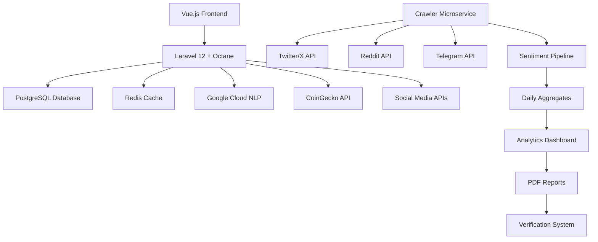

# 🛡️ Sentiment Shield - AI-Powered Blockchain Security Platform

[](https://github.com/mobin/sentimentshield/actions/workflows/monorepo-release.yml)
[](https://laravel.com)
[](https://vuejs.org)
[](LICENSE)
[](https://sentimentshield.app)

**Sentiment Shield** is the world's first **AI-powered dual-analysis platform** that combines smart contract security auditing with real-time social sentiment analysis, providing comprehensive risk assessment for the Web3 ecosystem.

## 🏆 **Complete Feature Set**

### 🔍 **AI-Powered Analysis**
- ✅ **Smart Contract Security Analysis** - OWASP-compliant vulnerability detection
- ✅ **Google Cloud NLP Integration** - Advanced sentiment analysis pipeline
- ✅ **OpenAI Streaming Analysis** - Real-time AI insights with SSE
- ✅ **Automated Risk Assessment** - ML-driven security scoring

### 🕷️ **Social Media Intelligence**
- ✅ **Multi-Platform Crawler** - Twitter/X, Reddit, Telegram monitoring
- ✅ **Keyword Rule Engine** - Advanced pattern matching and filtering
- ✅ **Sentiment vs Price Correlation** - Real-time market analysis
- ✅ **Daily Aggregation Pipeline** - Comprehensive trend tracking

### 📊 **Data Visualization**
- ✅ **Interactive Vue.js Charts** - Chart.js integration with real-time updates
- ✅ **Sentiment vs Price Timeline** - CoinGecko API integration
- ✅ **Risk Matrix Visualization** - Multi-dimensional security metrics
- ✅ **Platform Analytics Dashboard** - Comprehensive insights panel

### 📄 **Advanced Reporting**
- ✅ **PDF Generation System** - Browserless + DomPDF dual architecture
- ✅ **Vue Component to PDF** - Pixel-perfect report generation
- ✅ **Automated Report Scheduling** - Time-based report delivery
- ✅ **Multi-format Export** - CSV, JSON, PNG support

### 🛡️ **Security & Verification**
- ✅ **Cryptographic Verification Badges** - SHA-256 + HMAC signed URLs
- ✅ **Anti-Spoofing Protection** - Multi-layer security validation
- ✅ **Contract Verification System** - Tamper-proof badge generation
- ✅ **Rate Limiting & Access Control** - Enterprise security measures

### ⚡ **High-Performance Architecture**
- ✅ **Laravel Octane** - Swoole/RoadRunner high-performance runtime
- ✅ **PostgreSQL Caching** - Intelligent multi-layer caching system
- ✅ **Redis Integration** - Queue management and session storage
- ✅ **Docker Containerization** - Production-ready deployment

## 🚀 **Quick Start**

### **Option 1: Automated Setup (Recommended)**
```bash
git clone https://github.com/mobin/ai-blockchain-analytics.git
cd ai-blockchain-analytics
chmod +x scripts/setup-monorepo.sh
./scripts/setup-monorepo.sh
```

### **Option 2: Manual Setup**
```bash
# Clone repository
git clone https://github.com/mobin/ai-blockchain-analytics.git
cd ai-blockchain-analytics

# Copy environment configuration
cp .env.example .env

# Start Docker services
docker-compose up -d

# Install dependencies
docker-compose exec app composer install
docker-compose exec app php artisan key:generate
docker-compose exec app php artisan migrate --seed

# Install frontend dependencies
npm install
npm run dev
```

### **Option 3: Laravel Octane Development**
```bash
# Install Octane
composer require laravel/octane
php artisan octane:install --server=swoole

# Start high-performance server
php artisan octane:start --workers=4 --task-workers=2
```

## 🏗️ **System Architecture**



## 📊 **Technology Stack**

### **Backend**
- **Laravel 12** - Latest PHP framework with modern features
- **Laravel Octane** - High-performance application server
- **PostgreSQL 16** - Advanced relational database
- **Redis 7** - In-memory data structure store
- **Google Cloud NLP** - AI-powered text analysis
- **OpenAI API** - Advanced language model integration

### **Frontend**
- **Vue.js 3** - Progressive JavaScript framework
- **Inertia.js** - Modern monolith approach
- **Tailwind CSS** - Utility-first CSS framework
- **Chart.js** - Interactive data visualization
- **Vite** - Fast build tool and development server

### **Infrastructure**
- **Docker** - Containerization platform
- **GitHub Actions** - CI/CD pipeline automation
- **Browserless** - Headless Chrome for PDF generation
- **Swoole/RoadRunner** - High-performance PHP runtime

## 🎯 **Key Features Showcase**

### **1. Smart Contract Analysis**
```php
// AI-powered vulnerability detection
$analysis = app(SmartContractAnalyzer::class)
    ->analyzeContract($contractCode)
    ->withSecurityChecks()
    ->withOWASPCompliance()
    ->generateReport();
```

### **2. Social Media Sentiment Pipeline**
```php
// Process social media through Google NLP
$pipeline = app(SentimentPipelineService::class)
    ->processTextPipeline($socialMediaPosts)
    ->generateDailyAggregates()
    ->correlateWithPrices();
```

### **3. Verification Badge System**
```php
// Generate cryptographically signed verification
$verification = app(VerificationBadgeService::class)
    ->generateVerificationUrl($contractAddress)
    ->withHMACSignature()
    ->withAntiSpoofing();
```

### **4. PDF Generation from Vue**
```php
// Convert Vue components to PDF
$pdf = app(PdfGenerationService::class)
    ->generateFromVueComponent('DashboardReport', $data)
    ->withBrowserless()
    ->withPrintOptimization();
```

## 📱 **Demo & Documentation**

### **Live Demo**
- **Dashboard**: `http://localhost:8000/dashboard`
- **Sentiment Analysis**: `http://localhost:8000/sentiment-analysis`
- **Contract Verification**: `http://localhost:8000/get-verified`
- **PDF Reports**: `http://localhost:8000/pdf`

### **API Documentation**
```bash
# Sentiment Analysis API
GET /api/sentiment/price-correlation
POST /api/sentiment/analyze

# Crawler Microservice API
POST /api/crawler/start
GET /api/crawler/status

# Verification API
POST /api/verification/generate
GET /api/verification/status/{contract}

# PDF Generation API
POST /api/pdf/dashboard
POST /api/pdf/sentiment
```

## 🛠️ **Development Commands**

### **Laravel Octane**
```bash
# Start Octane server
php artisan octane:start --workers=4 --task-workers=2

# Reload Octane workers
php artisan octane:reload

# Stop Octane server
php artisan octane:stop
```

### **Crawler Microservice**
```bash
# Start crawler with platforms
php artisan crawler:start --platforms=twitter,reddit --keywords="blockchain,defi"

# Check crawler status
php artisan crawler:status

# Cache analytics demo
php artisan crawler:cache:demo --platforms=all
```

### **Sentiment Pipeline**
```bash
# Process sentiment data
php artisan sentiment:process --source=crawler --aggregate

# Generate daily aggregates
php artisan sentiment:aggregate --date=today

# Run complete pipeline
php artisan pipeline:sentiment --platforms=twitter,reddit --async
```

### **PDF Generation**
```bash
# Test PDF generation
php artisan pdf:test --type=dashboard

# Generate demo reports
php artisan pdf:demo --all
```

### **Verification System**
```bash
# Generate verification badge
php artisan verification:generate 0x1234... --project="My DeFi Protocol"

# Check verification status
php artisan verification:status 0x1234...
```

## 🧪 **Testing**

### **Run All Tests**
```bash
# Backend tests
composer test

# Frontend tests (when implemented)
npm run test

# CI pipeline tests
docker-compose -f docker-compose.ci.yml up --abort-on-container-exit
```

### **Specific Test Suites**
```bash
# Security analysis tests
php artisan test --filter=SecurityAnalysisTest

# Sentiment pipeline tests
php artisan test --filter=SentimentPipelineTest

# Verification system tests
php artisan test --filter=VerificationTest
```

## 📦 **Deployment**

### **Production Deployment**
```bash
# Build for production
composer install --optimize-autoloader --no-dev
npm run build

# Optimize Laravel
php artisan config:cache
php artisan route:cache
php artisan view:cache

# Start Octane in production
php artisan octane:start --server=swoole --workers=8 --task-workers=4
```

### **Docker Production**
```bash
# Build production image
docker build -t ai-blockchain-analytics:latest .

# Run with Docker Compose
docker-compose -f docker-compose.prod.yml up -d
```

## 🤝 **Contributing**

1. Fork the repository
2. Create a feature branch (`git checkout -b feature/amazing-feature`)
3. Commit your changes (`git commit -m 'Add some amazing feature'`)
4. Push to the branch (`git push origin feature/amazing-feature`)
5. Open a Pull Request

### **Development Guidelines**
- Follow PSR-12 coding standards
- Write comprehensive tests
- Update documentation
- Use semantic commit messages

## 📄 **License**

This project is licensed under the MIT License - see the [LICENSE](LICENSE) file for details.

## 🏆 **Acknowledgments**

- **Laravel Team** - For the amazing framework
- **Vue.js Team** - For the progressive framework
- **Google Cloud** - For NLP API services
- **CoinGecko** - For cryptocurrency data
- **Open Source Community** - For continuous inspiration

---

**Built with ❤️ by Mobin** | **Powered by Laravel 12 + Octane** | **Vue.js 3 + Inertia.js**