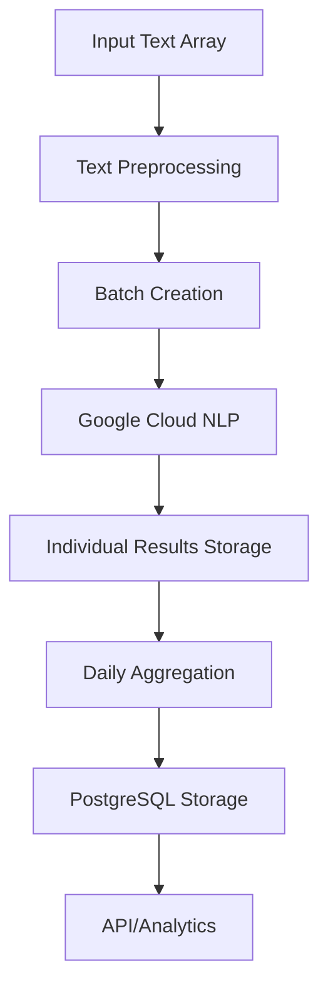

# 🔄 Sentiment Pipeline: Text → Google Cloud NLP → Daily Aggregates

A comprehensive Laravel-based sentiment analysis pipeline that processes text through Google Cloud NLP and stores daily aggregates for analytics and visualization.

## 🚀 Overview

This pipeline implements the complete flow:
```
Input Text → Preprocessing → Google Cloud NLP Batch Processing → Individual Results Storage → Daily Aggregation → Analytics
```

## 📋 Table of Contents

- [Features](#-features)
- [Architecture](#-architecture)
- [Installation](#-installation)
- [Usage](#-usage)
- [API Endpoints](#-api-endpoints)
- [Database Schema](#-database-schema)
- [Examples](#-examples)
- [Configuration](#-configuration)

## ✨ Features

- **Batch Processing** - Efficient handling of large text datasets
- **Google Cloud NLP Integration** - Real sentiment analysis via Google's AI
- **Daily Aggregation** - Automatic grouping by platform, category, and language
- **Queue Support** - Asynchronous processing for large datasets
- **Cost Tracking** - Automatic estimation of Google Cloud NLP costs
- **Multi-platform Support** - Twitter, Reddit, Telegram, and custom platforms
- **Comprehensive Logging** - Full audit trail and monitoring
- **Rate Limiting** - Respectful API usage with built-in delays
- **Error Handling** - Robust failure recovery and retry mechanisms

## 🏗️ Architecture

### Core Components

1. **`SentimentPipelineService`** - Main orchestration service
2. **`GoogleSentimentService`** - Google Cloud NLP integration
3. **`ProcessSentimentPipeline`** - Artisan command interface
4. **`SentimentPipelineController`** - REST API endpoints
5. **Database Models** - `SentimentBatch`, `SentimentBatchDocument`, `DailySentimentAggregate`

### Data Flow



## 🛠️ Installation

### Prerequisites

- Laravel 11+
- PHP 8.2+
- PostgreSQL
- Google Cloud NLP API credentials
- Redis (for queues)

### Setup

1. **Google Cloud NLP Configuration**
```bash
# Set your Google Cloud credentials path
export GOOGLE_APPLICATION_CREDENTIALS="/path/to/your/credentials.json"
```

2. **Environment Variables**
```env
# .env
GOOGLE_CLOUD_PROJECT=your-project-id
GOOGLE_APPLICATION_CREDENTIALS=/path/to/credentials.json
```

3. **Run Migrations**
```bash
php artisan migrate
```

4. **Queue Configuration**
```bash
# Start queue workers
php artisan queue:work --queue=sentiment-analysis
```

## 🎯 Usage

### Command Line Interface

#### Basic Usage
```bash
# Process single text
php artisan sentiment:process-pipeline --text="Bitcoin is amazing!"

# Process from JSON file
php artisan sentiment:process-pipeline --file=storage/app/sample_texts.json

# Queue large batches
php artisan sentiment:process-pipeline --file=large_dataset.json --queue

# With custom options
php artisan sentiment:process-pipeline \
  --file=sample_texts.json \
  --platform=twitter \
  --category=crypto \
  --language=en \
  --batch-size=50
```

#### Monitoring
```bash
# Check all batches
php artisan sentiment:batch-status --all

# Check specific batch
php artisan sentiment:batch-status {batch-id}

# Filter by status
php artisan sentiment:batch-status --all --status=completed --limit=20
```

### Programmatic Usage

```php
use App\Services\SentimentPipelineService;

$pipeline = app(SentimentPipelineService::class);

// Synchronous processing
$result = $pipeline->processTextPipeline([
    'Bitcoin is showing great potential!',
    'The market seems very volatile today.',
    'Smart contracts are revolutionary technology.'
], [
    'platform' => 'twitter',
    'category' => 'crypto',
    'language' => 'en'
]);

// Asynchronous processing
$batchId = $pipeline->queueTextPipeline($texts, $options);
$status = $pipeline->getBatchStatus($batchId);
```

## 🌐 API Endpoints

### Process Text
```bash
POST /api/sentiment-pipeline/process-text
```

**Request:**
```json
{
    "texts": [
        "Bitcoin is showing incredible growth!",
        "Market volatility is concerning."
    ],
    "options": {
        "platform": "twitter",
        "category": "crypto",
        "language": "en",
        "batch_size": 25
    },
    "queue": false
}
```

**Response:**
```json
{
    "success": true,
    "result": {
        "status": "success",
        "processed_count": 2,
        "daily_aggregates": 1,
        "processing_time": 2.45,
        "cost_estimate": 0.001,
        "batch_info": {
            "total": 2,
            "successful": 2,
            "failed": 0,
            "success_rate": 100
        }
    }
}
```

### Get Daily Aggregates
```bash
GET /api/sentiment-pipeline/daily-aggregates?start_date=2024-01-01&end_date=2024-01-31&platform=twitter
```

### Get Sentiment Trends
```bash
GET /api/sentiment-pipeline/trends?days=30&platform=twitter&category=crypto
```

### Batch Status
```bash
GET /api/sentiment-pipeline/batch-status/{batchId}
```

### Configuration
```bash
GET /api/sentiment-pipeline/configuration
```

## 🗄️ Database Schema

### `sentiment_batches`
- `id` - Primary key
- `batch_id` - Unique batch identifier
- `processing_date` - Date of processing
- `status` - pending, processing, completed, failed
- `total_documents` - Total documents in batch
- `processed_documents` - Successfully processed count
- `failed_documents` - Failed processing count
- `processing_stats` - JSON metadata
- `started_at` / `completed_at` - Timestamps

### `sentiment_batch_documents`
- `id` - Primary key
- `sentiment_batch_id` - Foreign key to batch
- `document_text` - Original text
- `document_metadata` - JSON metadata
- `sentiment_score` - Numerical sentiment (-1 to 1)
- `sentiment_magnitude` - Confidence measure
- `sentiment_category` - very_positive, positive, neutral, negative, very_negative
- `processing_results` - Full Google NLP response
- `status` - processing, completed, failed

### `daily_sentiment_aggregates`
- `id` - Primary key
- `aggregate_date` - Date of aggregation
- `platform` - twitter, reddit, telegram, etc.
- `keyword_category` - crypto, defi, nft, etc.
- `language` - Language code (en, es, fr, etc.)
- `total_posts` - Count of posts
- `average_sentiment` - Mean sentiment score
- `weighted_sentiment` - Engagement-weighted sentiment
- `sentiment_volatility` - Standard deviation
- `very_positive_count` through `very_negative_count` - Distribution counts
- `top_keywords` - JSON array of trending keywords
- `top_entities` - JSON array of extracted entities
- `total_engagement` - Sum of engagement metrics

## 💡 Examples

### Sample JSON Input
```json
[
    {
        "text": "Bitcoin is showing incredible growth potential this month.",
        "metadata": {
            "platform": "twitter",
            "category": "crypto",
            "engagement": 150,
            "timestamp": "2024-01-15T10:30:00Z"
        }
    },
    {
        "text": "Smart contracts are revolutionizing automated agreements.",
        "metadata": {
            "platform": "telegram",
            "category": "technology",
            "engagement": 89
        }
    }
]
```

### Daily Aggregate Output
```json
{
    "aggregate_date": "2024-01-15",
    "platform": "twitter",
    "keyword_category": "crypto",
    "language": "en",
    "total_posts": 50,
    "average_sentiment": 0.234,
    "weighted_sentiment": 0.267,
    "sentiment_volatility": 0.156,
    "very_positive_count": 12,
    "positive_count": 18,
    "neutral_count": 15,
    "negative_count": 4,
    "very_negative_count": 1,
    "top_keywords": {
        "bitcoin": 25,
        "blockchain": 18,
        "cryptocurrency": 12
    },
    "total_engagement": 3450
}
```

## ⚙️ Configuration

### Pipeline Options
```php
$options = [
    'batch_size' => 25,        // Texts per batch (1-100)
    'platform' => 'twitter',   // Platform identifier
    'category' => 'crypto',    // Category for aggregation
    'language' => 'en',        // Language code
    'date' => '2024-01-15',    // Processing date
    'queue' => 'sentiment-analysis' // Queue name
];
```

### Google Cloud NLP Settings
```php
// config/services.php
'google_language' => [
    'credentials' => env('GOOGLE_APPLICATION_CREDENTIALS'),
    'project_id' => env('GOOGLE_CLOUD_PROJECT'),
],

// config/sentiment_pipeline.php
'google_nlp' => [
    'batch_size' => 25,
    'rate_limit_delay' => 100, // milliseconds
    'max_retries' => 3,
    'timeout' => 30,
],
```

### Supported Languages
- `en` - English
- `es` - Spanish  
- `fr` - French
- `de` - German
- `it` - Italian
- `pt` - Portuguese
- `ru` - Russian
- `ja` - Japanese
- `ko` - Korean
- `zh` - Chinese

## 💰 Cost Estimation

Google Cloud NLP pricing (approximate):
- **Sentiment Analysis**: $0.0005 per 1,000 characters
- **Entity Extraction**: $0.0005 per 1,000 characters  
- **Classification**: $0.0005 per 1,000 characters

The pipeline automatically calculates costs based on text length and provides estimates in the response.

## 🔍 Monitoring & Debugging

### Logs
```bash
# View pipeline logs
tail -f storage/logs/laravel.log | grep "sentiment"

# Queue monitoring
php artisan queue:monitor sentiment-analysis

# Failed jobs
php artisan queue:failed
```

### Health Checks
```bash
# Check pipeline status
php artisan sentiment:status

# View aggregates
php artisan sentiment:aggregates --date=2024-01-15
```

## 🚀 Demo

Run the standalone demo:
```bash
php demo_sentiment_pipeline.php
```

This demonstrates the complete pipeline flow without requiring database connectivity.

## 🔧 Troubleshooting

### Common Issues

1. **Google Cloud Authentication**
   ```bash
   export GOOGLE_APPLICATION_CREDENTIALS="/path/to/credentials.json"
   gcloud auth application-default login
   ```

2. **Queue Not Processing**
   ```bash
   php artisan queue:work --queue=sentiment-analysis
   ```

3. **Database Connection**
   ```bash
   php artisan migrate:status
   php artisan migrate
   ```

4. **Rate Limiting**
   - Increase delays between batch processing
   - Reduce batch size
   - Monitor Google Cloud quotas

## 📊 Performance

### Benchmarks
- **Small batches** (1-10 texts): ~1-3 seconds
- **Medium batches** (50-100 texts): ~30-60 seconds  
- **Large batches** (1000+ texts): Queue recommended

### Optimization Tips
- Use queued processing for >50 texts
- Batch size of 25-50 for optimal performance
- Enable caching for repeated analyses
- Monitor Google Cloud quotas and billing

## 🤝 Contributing

1. Fork the repository
2. Create feature branch (`git checkout -b feature/amazing-feature`)
3. Commit changes (`git commit -m 'Add amazing feature'`)
4. Push to branch (`git push origin feature/amazing-feature`)
5. Open Pull Request

## 📄 License

This project is licensed under the MIT License.

---

**Built with ❤️ for AI Blockchain Analytics** 